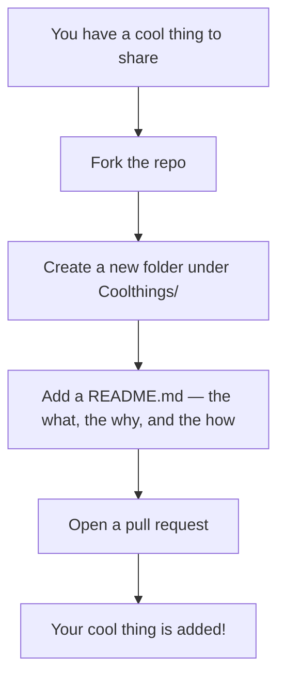

 

# OneCoolThing

**One lesson &nbsp;·&nbsp; One trick &nbsp;·&nbsp; One cool thing**

A language-agnostic collection of bite-sized programming lessons.  
Each entry covers one specific concept, tool, or technique — clean, focused, and actually useful.

 

 

[Browse Lessons](#whats-inside) &nbsp;·&nbsp; [How to Contribute](#how-to-contribute) &nbsp;·&nbsp; [matveyosipov.com ↗](https://www.matveyosipov.com)

 

---

## About

**OneCoolThing** is a growing, community-friendly repo where each entry teaches exactly one programming concept, trick, or tool — in its own folder, with its own README.

The idea: you learn something cool, you share it. No massive tutorials, no framework deep-dives. Just one focused, working example at a time.

---

## What's Inside

| # | Lesson | Category | Technologies |
| --- | -------- | ---------- | ------------ |
| 01 | [**GitHub Pages Personal Profile**](Coolthings/GithubPages/) | Web |    |
| 02 | [**X12 EDI → SQL Database Parser**](Coolthings/EDI/ParseX12_2_Database/) | Data / EDI |    |
| 03 | [**Linux & WSL Quick-Start**](Coolthings/Linux/) | Linux / DevOps |   |

> More lessons in progress — and yours could be here too.

---

## The One Rule

> Each lesson must cover **exactly one thing**. Keep the folder self-contained, the README concise, and the code runnable. A quick win that somebody can build on beats a wall of text every time.

---

## How to Contribute

1. **Fork** this repo
2. Create your folder: `Coolthings/<Category>/<YourCoolThing>/`
3. Add a `README.md` — keep it focused on the one thing
4. Open a pull request

---

### Technologies Covered So Far

 

 

Built by <a href="https://www.matveyosipov.com">Matvey Osipov</a> · Started May 2026

