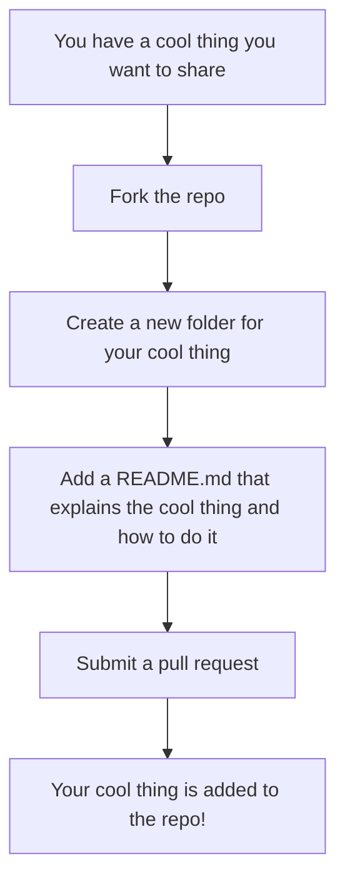

# OneCoolThing

Gives One Point Lessons for various cool things you can do with various programming languages and tools - constant work in progress, starting 05/24/2026

This is intended to be not focused on any one language or tool, but rather a collection of cool things you can do with various languages and tools. The goal is to have a wide variety of cool things that can be done with different languages and tools, so that there is something for everyone.

Overall rule is to focus one 1 thing per lesson, and to keep it as simple as possible while still being useful. The idea is to give people a quick win that they can build on, rather than overwhelming them with too much information at once (but of course there will be some variation in how much information is needed for each lesson).

Want to add a cool thing? Fork the repo, add your cool thing as a new folder with a README.md that explains the cool thing and how to do it, and then submit a pull request. Please try to keep the cool things focused on one specific thing, and to keep the README.md clear and concise.

